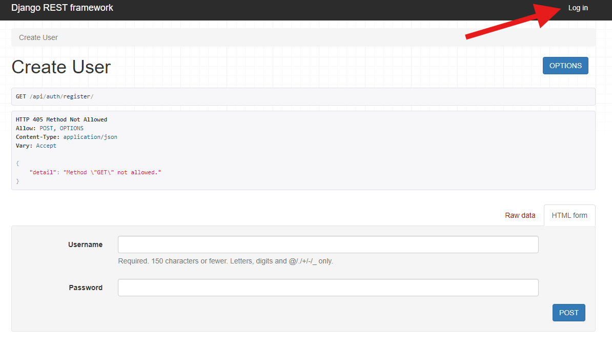
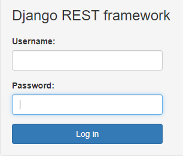
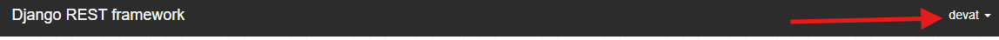

# Configuración y Ejecución del Proyecto

## Requisitos previos
- Python 3.10.12 instalado en tu sistema.
- Pip (administrador de paquetes de Python) instalado.
- virtualenv o venv para la creacion de entornos

## Pasos para configurar el proyecto
1. Clona el repositorio desde GitHub: `git clone https://github.com/ajtp18/prueba-django.git`
2. Navega hasta el directorio del proyecto: `cd tu-proyecto`
3. Crea un entorno virtual: `python3 -m venv venv`
4. Activa el entorno virtual:
    - En Windows: `venv\Scripts\activate`
    - En macOS/Linux: `source venv/bin/activate`
5. Instala las dependencias del proyecto: `pip install -r requirements.txt`
6. Configura la base de datos:
    - La configuracion de la base de datos se generara cuando se inicie el servicio, sin embargo, antes debemos realizar unas configuraciones
7. Crea y realiza las migraciones de la base de datos:
    - `python manage.py migrate`

## Ejecución del proyecto
1. Inicia el servidor de desarrollo: `python manage.py runserver`
2. Abre tu navegador web y visita:
    - http://127.0.0.1:8000/api/auth/register/ para ver el proyecto en funcionamiento y comenzar con la creacion de su usuario.
3. luego de haber creado el usuario, lo siguiente sera iniciar sesion para poder utilizar todos los endpoints expuestos en el proyecto:
    - 
    - inicie sesion 
        
    - Sabra que esta loggeado en la pagina cuando aparezca el nombre del usuario creado:
    
4. Para consultar los endpoints expuestos que son:

    - http://127.0.0.1:8000/api/products/get/
    - http://127.0.0.1:8000/api/products/create/
    - http://127.0.0.1:8000/api/products/update/
    - http://127.0.0.1:8000/api/products/delete/

    - ### nota: Es recomendable usar Postman para el consumo de los endpoints, en caso tal de que esa sea la necesidad, dejare proporcionado una coleccion con los endpoints y los metodos de autenticacion.

5. ### Postman collection:
    - en esta parte lo mas importante es el metodo de autenticacion, es por medio de Basic Auth, es decir username y password.
    - en el create product, usaremos el formato form-data, para la insercion de la data y la imagen.
    - en el update y delete se le debe pasar el id al cual se quiere eliminar/actualizar, ejemplo: http://127.0.0.1:8000/api/products/delete/2/, el delete solo requerira de este id, el update requerira por raw/json la data a actualizar.
    - Por ultimo quedan expuestos el endpoint de Registrar usuario y el Get de Productos.

## Ejecución de las pruebas unitarias
1. Asegúrate de que el servidor de desarrollo no esté en ejecución.
2. Ejecuta las pruebas unitarias: `python manage.py test`
